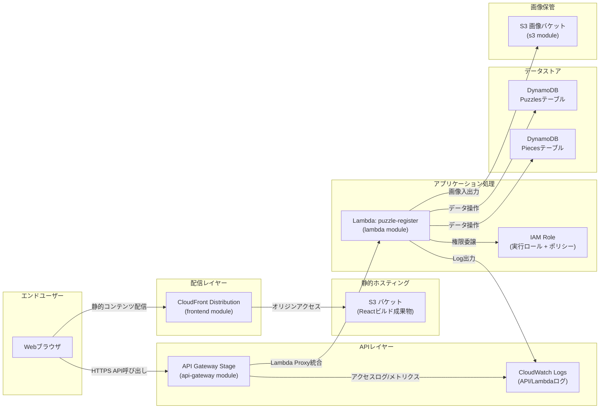

# 本番運用の全体像（AWS）

本ドキュメントでは、`jigsaw-puzzle` の本番運用を想定したAWS構成を俯瞰的に説明します。Terraformモジュールで構築される各リソースがどのように連携し、ユーザーのリクエストがどの経路を辿るかを把握することが目的です。

## アーキテクチャ図

## コンポーネント別の役割

- **CloudFront / S3（frontend module）**  
  ビルド済みのReactアプリをS3に配置し、CloudFrontでHTTPS配信します。OAC（Origin Access Control）を用いて、CloudFront経由のリクエストのみS3に到達できるよう制限しています。

- **API Gateway（api-gateway module）**  
  `/` および任意パスをまとめてLambdaへプロキシするREST APIを提供します。`aws_api_gateway_method_settings` でメトリクス収集とリクエストスロットリングが設定済みです。CloudWatch Logsグループは自動作成されるため、アクセスログを有効化したい場合はステージ設定でコメントアウトを解除します。

- **Lambda & IAM（lambda / iam modules）**  
  `puzzle-register` 関数がAPIリクエストを受け、S3/DynamoDB/画像解析（Rekognition想定）を操作します。IAMロールにはCloudWatch Logs、S3、DynamoDB、およびRekognitionへのアクセス権を付与しています。環境変数でテーブル名やバケット名、CORS許可オリジンを注入します。

- **データストア（dynamodb module）**  
  `Puzzles` と `Pieces` テーブルをオンデマンド課金で作成し、GSIやTTL、PITRを有効化して可観測性・保守性を高めています。LambdaはテーブルARNとインデックスARNに限定された権限で操作します。

- **画像バケット（s3 module）**  
  パズル画像などの大きなデータを保管します。ライフサイクルルールで一時ファイル削除・コスト最適化を実施し、CORS設定によりフロントエンドからの直接アップロードを許可します。

- **CloudWatch Logs**  
  API GatewayとLambda双方のログが格納されます。保持期間は変数 `log_retention_days` で調整可能です。アラーム設計や分析時はこのロググループを参照します。

## リクエストの典型的な流れ（例: パズル登録）

1. ユーザーがブラウザからCloudFront経由でフロントエンドを閲覧。  
2. 登録フォーム送信時に、フロントエンドがAPI GatewayのステージURL（例: `https://{api-id}.execute-api.ap-northeast-1.amazonaws.com/prod/puzzles`）へHTTPSリクエスト。  
3. API Gatewayが`ANY /{proxy+}`メソッドでLambdaをプロキシ呼び出し。  
4. Lambdaがリクエスト内容を処理し、必要に応じてS3に画像を保存・DynamoDBにメタデータを記録。  
5. 処理結果をAPI Gateway経由でクライアントへ返却。Lambda実行ログはCloudWatchに送信される。

## 運用時のチェックポイント

- **デプロイ**  
  Terraformは環境ディレクトリ（例: `terraform/environments/prod`）から `terraform plan/apply` を実行します。Lambdaコードの反映は `scripts/deploy-lambda.sh` でZipを更新してください。

- **監視**  
  CloudWatch Logsを基にメトリクスやメトリクスフィルタを作成し、アラームを設定します。API Gatewayのスロットリング値は利用状況に応じて変数で調整可能です。

- **セキュリティ**  
  IAMロールの権限は必要最小限に限定済みですが、新機能追加時はS3/DynamoDB/Rekognitionのアクセス範囲を再点検します。API GatewayにCognito Authorizer等の認証を追加する場合は、モジュールを拡張します。

- **コスト最適化**  
  DynamoDBはオンデマンド課金のため、トラフィックが増えた際はProvisioned/Auto Scaling切り替えも検討します。S3のライフサイクルやCloudFrontのキャッシュ設定は運用状況に合わせて調整してください。

この構成により、フロントエンド配信・API処理・データ永続化・バッチ解析までをAWS上で疎結合に実装し、Terraformモジュールで再利用可能な形に整理しています。運用チームは各コンポーネントの役割と結合点を把握することで、変更や障害時の影響範囲を即座に判断できるようになります。
