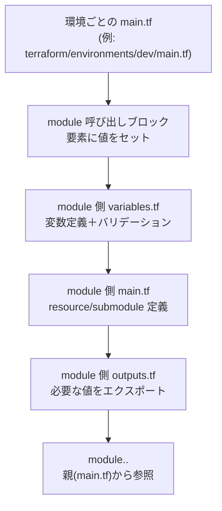

# Terraformにおける main.tf / variables.tf / outputs.tf の役割

Terraform モジュールには常に「定義・入力・出力」の3ファイルが登場します。本ドキュメントでは、`jigsaw-puzzle` リポジトリの実例を用いながら、それぞれがどのように連携してインフラ構成を作っているのかを整理します。

## 全体像



1. 環境ごとの `main.tf` でモジュールを呼び出し、引数に値を渡す。  
2. モジュール側の `variables.tf` が受け取り口として型・説明・デフォルト値を定義。  
3. モジュールの `main.tf` が実際の AWS リソースやサブモジュールを作成。  
4. 必要な情報を `outputs.tf` で公開し、親モジュール（＝呼び出し元）が利用する。

以下では各ファイルの役割を、API Gateway モジュールを例に詳しく見ていきます。

## main.tf — リソースと依存関係の定義

- モジュールを構成する中核ファイルで、AWS リソース（`resource` ブロック）や他モジュールの呼び出し（`module` ブロック）が記述されます。
- 例: `terraform/modules/api-gateway/main.tf:16` では REST API を作成する `aws_api_gateway_rest_api.main` を定義。  
  同ファイル内で `/puzzles` など任意パスを Lambda に転送するリソース・メソッド・統合を組み立てています (`terraform/modules/api-gateway/main.tf:37`, `terraform/modules/api-gateway/main.tf:70` など)。
- デプロイやステージ、CloudWatch Logs 設定も同じ main.tf に含めて、モジュールだけで API Gateway 周辺が完結する構成です (`terraform/modules/api-gateway/main.tf:109-195`)。

モジュールの `main.tf` ではベストプラクティスとして「同モジュール内で完結するリソースを一括で定義し、外部には抽象化された変数・出力のみ見せる」ことを意識します。

## variables.tf — 入力パラメータの受け口

- `variable "<name>"` ブロックを並べ、モジュール外部から渡される値の型、説明、デフォルト値を定義します。
- 例: API Gateway モジュールでは `project_name`、`environment`、`common_tags` など命名やタグ付けに必要な値を宣言 (`terraform/modules/api-gateway/variables.tf:9-23`)。
- Lambda と統合するために `puzzle_register_lambda_invoke_arn` や `puzzle_register_lambda_function_name` を必須変数として宣言し、モジュール内のリソースと疎結合にしています (`terraform/modules/api-gateway/variables.tf:29-37`)。
- デフォルト値を持たせたい場合は `default` を指定。例としてスロットリング上限 (`throttling_burst_limit` / `throttling_rate_limit`) は 5000/10000 を初期値としています (`terraform/modules/api-gateway/variables.tf:53-62`)。

入力の型を `string` / `number` / `list(string)` などで明示することで、`terraform plan` 実行時に不正な値が渡された場合でも早期に検知できます。

## outputs.tf — 他モジュールへ渡す値の公開

- モジュール内部で作成したリソースの ID や URL など、外部で利用したい値は `output "<name>"` で公開します。
- 例: API Gateway モジュールはステージ URL (`api_endpoint`)、特定パス用の便宜的 URL (`puzzles_endpoint`)、デプロイ/ロググループのARNなどを提供 (`terraform/modules/api-gateway/outputs.tf:10-78`)。
- 親モジュールでは `module.api_gateway.api_endpoint` のようにドットで参照し、フロントエンド設定や他リソースへの紐付けに利用します。  
  実際に `terraform/environments/dev/main.tf` では出力を使っていませんが、将来的に CloudFront や Route 53 と連携する際に活用できます。

## 親モジュールでの呼び出し例

`terraform/environments/dev/main.tf:98-113` では、API Gateway モジュールを以下のように呼び出しています。

```hcl
module "api_gateway" {
  source = "../../modules/api-gateway"

  project_name = var.project_name
  environment  = var.environment
  common_tags  = local.common_tags

  puzzle_register_lambda_function_name = module.lambda.puzzle_register_function_name
  puzzle_register_lambda_invoke_arn    = module.lambda.puzzle_register_invoke_arn

  throttling_burst_limit = 5000
  throttling_rate_limit  = 10000
}
```

- `source` でモジュールのディレクトリを指定。  
- 呼び出し元の `var.project_name` などを API Gateway モジュールの変数へ渡し、命名規則を統一しています。  
- Lambda モジュールの出力 (`module.lambda.puzzle_register_function_name`) を API Gateway モジュールの変数にセットし、クロスモジュールの依存関係を明示的に表現しています。

## 応用: outputs を別モジュールで使う

`outputs.tf` を活かす具体例として、以下のような利用が考えられます。

```hcl
resource "aws_ssm_parameter" "api_endpoint" {
  name  = "/jigsaw-puzzle/backend/${var.environment}/api_endpoint"
  type  = "String"
  value = module.api_gateway.api_endpoint

  tags = local.common_tags
}
```

このように Terraform 内で値を受け渡しすることで、別サービス（例: Lambda 環境変数やフロントエンド設定）へ反映する処理を自動化できます。

## まとめ

- `main.tf` は「何を作るか」を定義するリソース集。モジュールの振る舞い本体。  
- `variables.tf` は「どんな入力を受け取るか」を宣言し、型とデフォルト値で安全性を確保。  
- `outputs.tf` は「外部へどんな値を提供するか」を整理し、依存関係を明文化。  

3つのファイルをセットで理解することで、Terraform モジュールの責務が明確になり、環境ごとの差分管理や再利用性が格段に向上します。今回の API Gateway モジュールの構造を押さえておくと、Lambda やその他サービスのモジュール設計にも応用できます。
