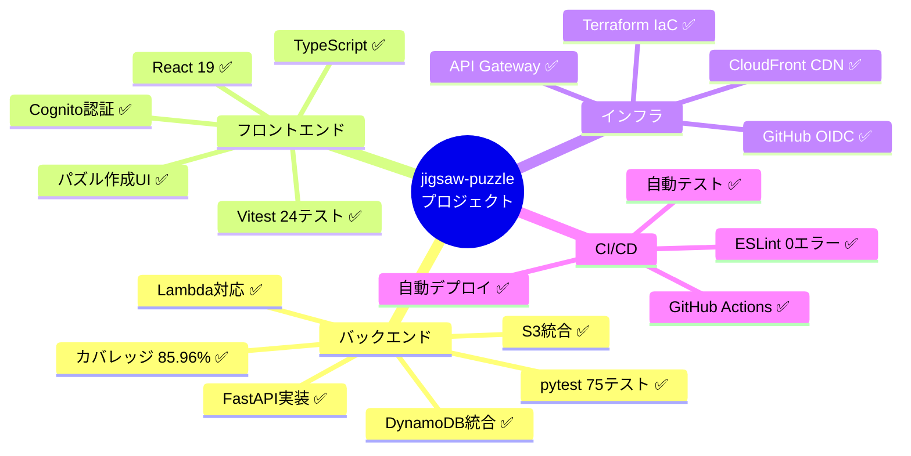
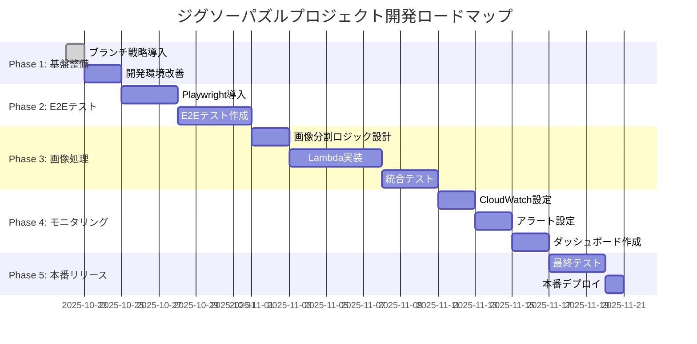
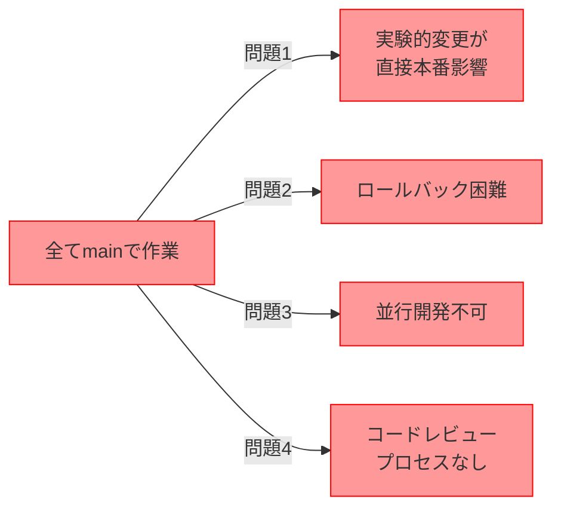
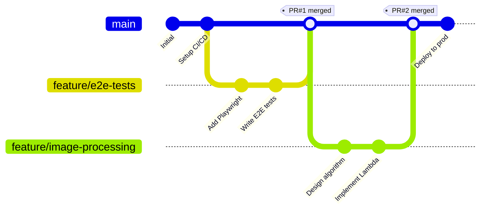
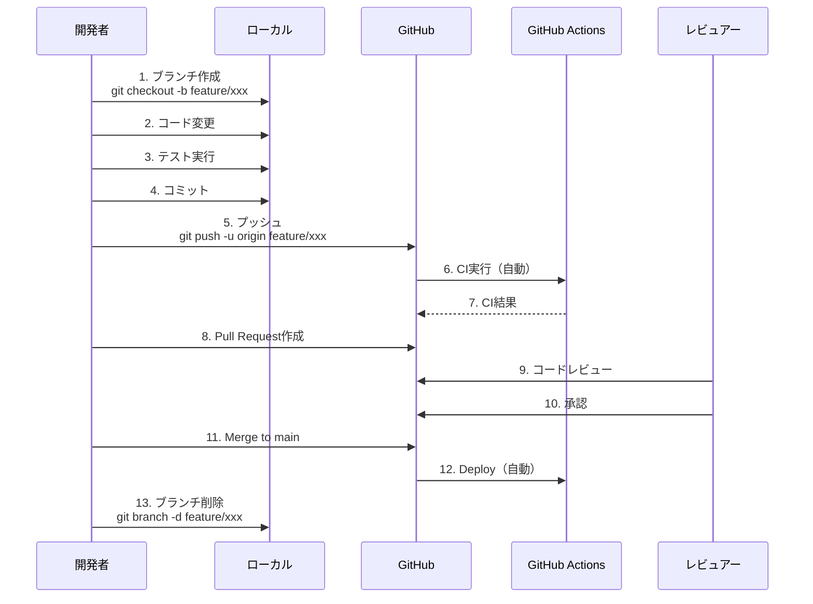
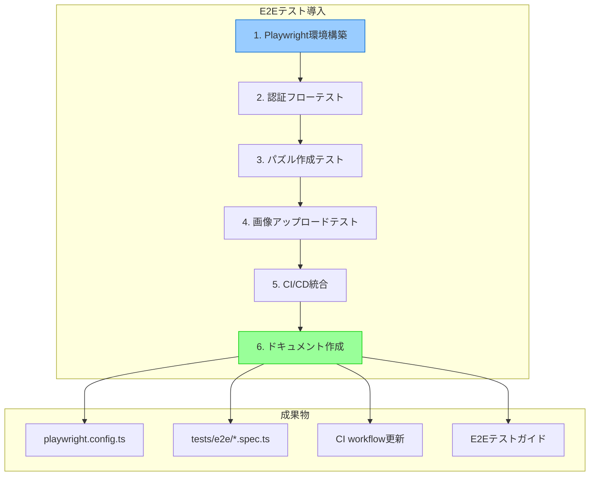
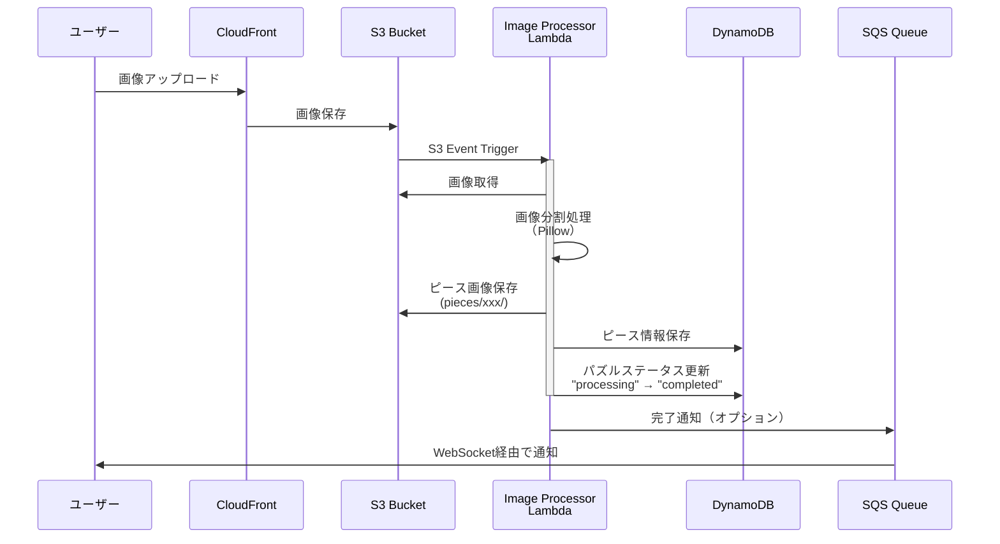
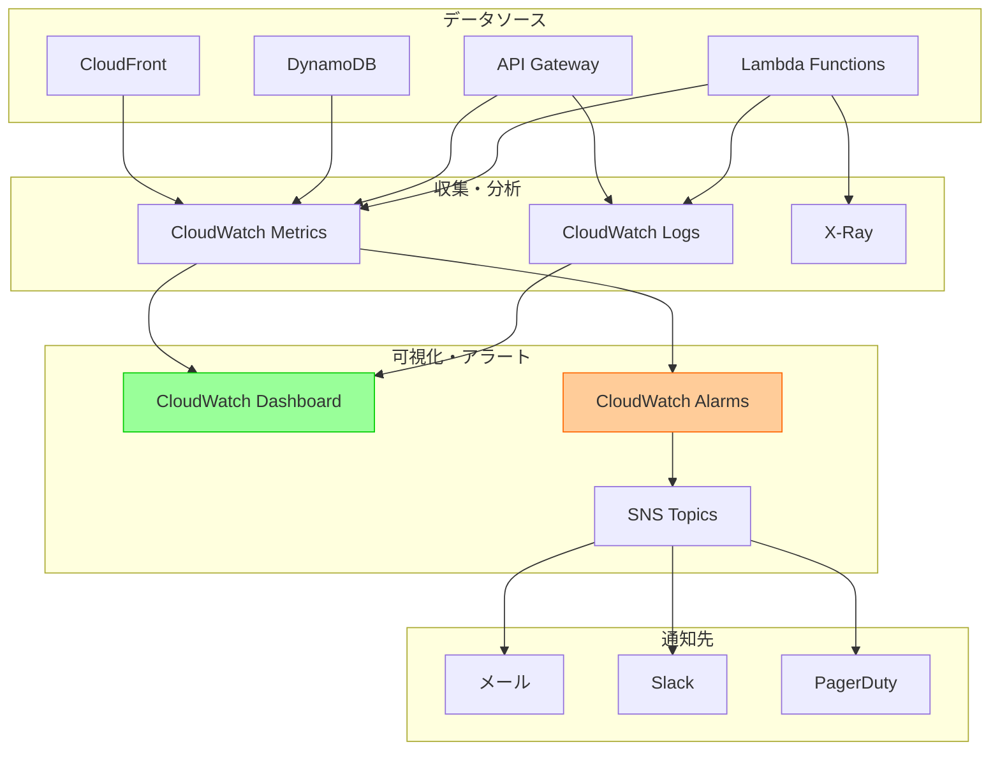
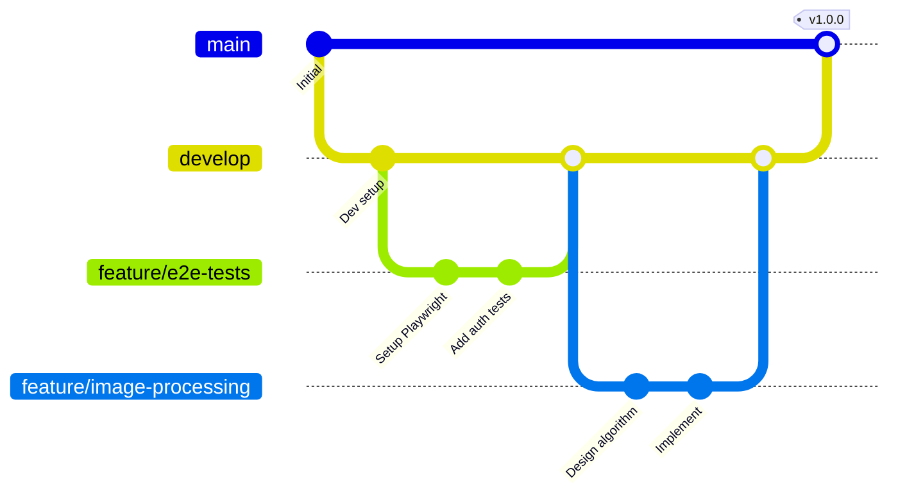

# 今後の開発計画とGitブランチ戦略

**作成日**: 2025年10月22日
**目的**: プロジェクトの次のステップとブランチ戦略の導入
**対象**: jigsaw-puzzle プロジェクト

---

## 📋 目次

1. [プロジェクトの現在地](#プロジェクトの現在地)
2. [今後のロードマップ](#今後のロードマップ)
3. [Gitブランチ戦略の導入](#gitブランチ戦略の導入)
4. [実践的なブランチワークフロー](#実践的なブランチワークフロー)
5. [次のマイルストーン詳細](#次のマイルストーン詳細)
6. [開発フローの例](#開発フローの例)

---

## プロジェクトの現在地

### ✅ 完了した主要機能



### 📊 現在の状態

| カテゴリ | 状態 | 完成度 |
|---------|------|--------|
| **バックエンドAPI** | ✅ 本番準備完了 | 95% |
| **フロントエンドUI** | ✅ 基本機能完成 | 85% |
| **認証・認可** | ✅ Cognito統合済み | 90% |
| **テスト** | ✅ 単体+統合 | 85% |
| **CI/CD** | ✅ 完全自動化 | 100% |
| **ドキュメント** | ⚠️  基本のみ | 70% |
| **E2Eテスト** | ❌ 未実装 | 0% |
| **モニタリング** | ⚠️  基本のみ | 40% |
| **画像処理** | ❌ 未実装 | 0% |

### 🎯 本番環境準備度: **85%**

**未実装の重要機能**:
1. 画像処理（ピース分割）
2. E2Eテスト
3. 本格的なモニタリング
4. エラー追跡（Sentry等）

---

## 今後のロードマップ

### 開発フェーズの全体像



### 優先順位付きタスク

#### 🔴 High Priority（2週間以内）

1. **Gitブランチ戦略の導入と実践**
   - GitHub Flowの導入
   - ブランチ命名規則の策定
   - Pull Request ワークフローの確立

2. **E2Eテストの導入**
   - Playwright環境構築
   - 主要フローのE2Eテスト作成
   - CI/CDへの統合

3. **画像処理機能の設計**
   - 画像分割アルゴリズムの調査
   - Lambda関数の設計
   - S3トリガーの設定

#### 🟡 Medium Priority（1ヶ月以内）

4. **モニタリングの強化**
   - CloudWatch Dashboardの作成
   - アラートの設定
   - ログ分析の改善

5. **エラー追跡の導入**
   - Sentry等のエラー追跡ツール導入
   - エラーレポート自動化

6. **パフォーマンス最適化**
   - Lambda Cold Start対策
   - DynamoDB容量最適化
   - CloudFront キャッシュ戦略

#### 🟢 Low Priority（長期）

7. **UI/UX改善**
   - レスポンシブデザイン改善
   - アクセシビリティ向上
   - ダークモード対応

8. **機能拡張**
   - パズル共有機能
   - ランキング機能
   - SNS連携

---

## Gitブランチ戦略の導入

### なぜブランチ戦略が必要か？

**現在の問題点**:


**ブランチ戦略のメリット**:
- ✅ 安全な実験環境
- ✅ 簡単なロールバック
- ✅ 並行開発が可能
- ✅ コードレビュープロセス
- ✅ 変更履歴の明確化

### GitHub Flowの採用

このプロジェクトには **GitHub Flow** が最適です。

**理由**:
1. シンプル（ブランチ2種類のみ）
2. 継続的デプロイに適している
3. 小規模〜中規模プロジェクトに最適
4. GitHub Actionsと相性が良い



### ブランチ命名規則

#### パターン: `<type>/<issue-number>-<short-description>`

**type の種類**:
| Type | 用途 | 例 |
|------|------|-----|
| `feature/` | 新機能追加 | `feature/123-e2e-tests` |
| `fix/` | バグ修正 | `fix/456-cors-error` |
| `refactor/` | リファクタリング | `refactor/789-puzzle-service` |
| `docs/` | ドキュメント | `docs/012-api-guide` |
| `test/` | テスト追加・修正 | `test/345-integration-tests` |
| `chore/` | 雑務（依存更新等） | `chore/678-update-deps` |
| `hotfix/` | 緊急修正 | `hotfix/901-critical-bug` |

**命名例**:
```bash
# Good
feature/e2e-tests
fix/cognito-login-error
refactor/puzzle-service-cleanup
docs/deployment-guide

# Bad
test
my-feature
john-dev
temp-branch
```

---

## 実践的なブランチワークフロー

### 基本的なワークフロー



### ステップバイステップガイド

#### Step 1: 新しいブランチを作成

```bash
# mainブランチが最新であることを確認
git checkout main
git pull origin main

# 新しいブランチを作成して切り替え
git checkout -b feature/e2e-tests

# ブランチが作成されたか確認
git branch
# * feature/e2e-tests  <- 現在のブランチ
#   main
```

#### Step 2: 作業とコミット

```bash
# ファイルを編集
# ...

# 変更を確認
git status
git diff

# ステージング
git add frontend/tests/e2e/

# コミット（詳細なメッセージ）
git commit -m "Add E2E tests for puzzle creation flow

- Install Playwright
- Create test for user registration
- Create test for puzzle creation
- Create test for image upload

Closes #123"
```

**良いコミットメッセージの例**:
```
Add E2E tests for puzzle creation flow

- Install Playwright and configure for TypeScript
- Create test for user registration flow
- Create test for puzzle creation with validation
- Create test for image upload with pre-signed URL
- Add test fixtures for common user actions

This provides end-to-end testing coverage for the main user
journey, ensuring all components work together correctly.

Closes #123
```

#### Step 3: プッシュとPR作成

```bash
# リモートにプッシュ（初回は -u で追跡設定）
git push -u origin feature/e2e-tests

# 以降は
git push
```

**GitHub上でPull Request作成**:
1. GitHubのリポジトリページに移動
2. "Compare & pull request" ボタンをクリック
3. PR内容を記入

**良いPRの例**:
```markdown
## 📝 概要
E2EテストをPlaywrightを使って実装しました。

## 🎯 目的
主要なユーザーフローをブラウザ自動化でテストし、
フロントエンドとバックエンドの統合を確認します。

## ✅ 変更内容
- Playwrightのインストールと設定
- ユーザー登録フローのE2Eテスト
- パズル作成フローのE2Eテスト
- 画像アップロードのE2Eテスト

## 🧪 テスト
- ✅ ローカルでE2Eテスト実行: 全て成功
- ✅ 単体テスト: 影響なし
- ✅ ESLint: エラーなし

## 📸 スクリーンショット
（必要に応じて）

## 🔗 関連Issue
Closes #123

## 📋 レビューポイント
- Playwrightの設定が適切か
- テストケースの網羅性
- テストの安定性（flaky testでないか）
```

#### Step 4: コードレビュー

**レビュアーの観点**:
- [ ] コードの品質
- [ ] テストの網羅性
- [ ] セキュリティ
- [ ] パフォーマンス
- [ ] ドキュメント

**レビューのフィードバック例**:
```markdown
# レビューコメント

## 良い点 👍
- E2Eテストの構成がわかりやすい
- エラーハンドリングが適切

## 改善提案 💡
1. `tests/e2e/fixtures.ts` のタイムアウトを環境変数から読み込むようにしませんか？
2. スクリーンショットの保存先を `.gitignore` に追加してください

## 質問 ❓
- Playwright の `baseURL` は環境ごとに変える予定ですか？
```

#### Step 5: マージとクリーンアップ

```bash
# GitHub上でPRをマージ後

# ローカルのmainを更新
git checkout main
git pull origin main

# 作業ブランチを削除
git branch -d feature/e2e-tests

# リモートブランチも削除（GitHub上で自動削除されない場合）
git push origin --delete feature/e2e-tests
```

---

## 次のマイルストーン詳細

### マイルストーン 1: E2Eテストの導入

**期間**: 1週間
**目標**: 主要フローのE2Eテストカバレッジ80%

#### タスクリスト



#### 詳細タスク

**1. Playwright環境構築**（1日）
```bash
# ブランチ作成
git checkout -b feature/playwright-setup

# Playwright インストール
cd frontend
npm install -D @playwright/test
npx playwright install

# 設定ファイル作成
# playwright.config.ts
```

**設定ファイル例**:
```typescript
// frontend/playwright.config.ts
import { defineConfig, devices } from '@playwright/test';

export default defineConfig({
  testDir: './tests/e2e',
  fullyParallel: true,
  forbidOnly: !!process.env.CI,
  retries: process.env.CI ? 2 : 0,
  workers: process.env.CI ? 1 : undefined,
  reporter: 'html',
  use: {
    baseURL: process.env.BASE_URL || 'http://localhost:5173',
    trace: 'on-first-retry',
    screenshot: 'only-on-failure',
  },

  projects: [
    {
      name: 'chromium',
      use: { ...devices['Desktop Chrome'] },
    },
    {
      name: 'firefox',
      use: { ...devices['Desktop Firefox'] },
    },
  ],

  webServer: {
    command: 'npm run dev',
    url: 'http://localhost:5173',
    reuseExistingServer: !process.env.CI,
  },
});
```

**2. 認証フローテスト**（2日）
```typescript
// frontend/tests/e2e/auth.spec.ts
import { test, expect } from '@playwright/test';

test.describe('Authentication Flow', () => {
  test('should register a new user', async ({ page }) => {
    await page.goto('/register');

    await page.fill('[name="email"]', 'test@example.com');
    await page.fill('[name="password"]', 'TestPass123!');
    await page.fill('[name="confirmPassword"]', 'TestPass123!');
    await page.click('button[type="submit"]');

    await expect(page).toHaveURL('/login');
    await expect(page.locator('.success-message')).toContainText('登録確認メールを送信しました');
  });

  test('should login with valid credentials', async ({ page }) => {
    await page.goto('/login');

    await page.fill('[name="email"]', 'test@example.com');
    await page.fill('[name="password"]', 'TestPass123!');
    await page.click('button[type="submit"]');

    await expect(page).toHaveURL('/');
    await expect(page.locator('.user-menu')).toBeVisible();
  });
});
```

**3. パズル作成テスト**（2日）
```typescript
// frontend/tests/e2e/puzzle-creation.spec.ts
import { test, expect } from '@playwright/test';

test.describe('Puzzle Creation Flow', () => {
  test.beforeEach(async ({ page }) => {
    // ログイン処理
    await page.goto('/login');
    await page.fill('[name="email"]', 'test@example.com');
    await page.fill('[name="password"]', 'TestPass123!');
    await page.click('button[type="submit"]');
    await expect(page).toHaveURL('/');
  });

  test('should create a new puzzle', async ({ page }) => {
    await page.click('text=新しいパズルを作成');

    await page.fill('[name="puzzleName"]', '富士山の風景');
    await page.selectOption('[name="pieceCount"]', '300');
    await page.click('button[type="submit"]');

    await expect(page.locator('.success-message')).toContainText('パズルを作成しました');
    await expect(page).toHaveURL(/\/puzzles\/[a-f0-9-]+/);
  });
});
```

**4. CI/CD統合**（1日）
```yaml
# .github/workflows/ci.yml に追加
  e2e-tests:
    name: E2E Tests
    runs-on: ubuntu-latest
    needs: [backend-tests, frontend-tests]

    steps:
      - name: Checkout code
        uses: actions/checkout@v4

      - name: Set up Node.js
        uses: actions/setup-node@v4
        with:
          node-version: '20'

      - name: Install dependencies
        working-directory: frontend
        run: npm install

      - name: Install Playwright browsers
        working-directory: frontend
        run: npx playwright install --with-deps

      - name: Run E2E tests
        working-directory: frontend
        env:
          BASE_URL: ${{ secrets.E2E_BASE_URL }}
        run: npx playwright test

      - name: Upload test results
        uses: actions/upload-artifact@v4
        if: always()
        with:
          name: playwright-report
          path: frontend/playwright-report/
```

---

### マイルストーン 2: 画像処理機能の実装

**期間**: 2週間
**目標**: 画像分割機能の完全実装

#### アーキテクチャ



#### タスクリスト

1. **画像分割アルゴリズムの実装**（3日）
   - Pillow (PIL) を使った画像分割
   - ピース数に応じたグリッド計算
   - ピース位置情報の保存

2. **Lambda関数の実装**（3日）
   - S3イベントトリガーの設定
   - 画像処理ロジック
   - エラーハンドリング

3. **統合テスト**（2日）
   - motoでS3イベントをシミュレート
   - 画像処理のテスト

4. **Terraform設定**（2日）
   - Lambda関数リソース追加
   - S3バケット通知設定
   - IAM権限設定

5. **ドキュメント作成**（1日）
   - 画像処理仕様書
   - トラブルシューティングガイド

---

### マイルストーン 3: モニタリング強化

**期間**: 1週間
**目標**: 本番運用レベルのモニタリング

#### モニタリングアーキテクチャ



#### 監視項目

**Lambda関数**:
- 実行時間（p50, p95, p99）
- エラー率
- スロットリング
- Cold Start頻度

**API Gateway**:
- リクエスト数
- レイテンシ
- 4xx/5xxエラー率

**DynamoDB**:
- 読み書きキャパシティ使用率
- スロットリングイベント
- テーブルサイズ

**アラート設定例**:
```hcl
# terraform/modules/monitoring/alarms.tf
resource "aws_cloudwatch_metric_alarm" "lambda_errors" {
  alarm_name          = "${var.project_name}-${var.environment}-lambda-errors"
  comparison_operator = "GreaterThanThreshold"
  evaluation_periods  = 2
  metric_name        = "Errors"
  namespace          = "AWS/Lambda"
  period             = 300
  statistic          = "Sum"
  threshold          = 5
  alarm_description  = "Lambda function error rate is too high"
  alarm_actions      = [aws_sns_topic.alerts.arn]

  dimensions = {
    FunctionName = aws_lambda_function.puzzle_register.function_name
  }
}
```

---

## 開発フローの例

### 実例: E2Eテスト導入の完全フロー

#### Day 1: 環境構築

```bash
# 1. Issue作成（GitHub上で）
# Title: "E2Eテストの導入"
# Description: Playwrightを使った主要フローのE2Eテスト
# Labels: enhancement, testing
# → Issue #123 が作成される

# 2. ブランチ作成
git checkout main
git pull origin main
git checkout -b feature/123-e2e-tests

# 3. Playwright インストール
cd frontend
npm install -D @playwright/test
npx playwright install

# 4. 設定ファイル作成
# playwright.config.ts を作成
# tests/e2e/ ディレクトリ作成

# 5. コミット
git add .
git commit -m "Setup Playwright for E2E testing

- Install @playwright/test
- Create playwright.config.ts with Chromium and Firefox
- Set up test directory structure

Part of #123"

# 6. プッシュ
git push -u origin feature/123-e2e-tests
```

#### Day 2-3: テスト作成

```bash
# 7. 認証テスト作成
# tests/e2e/auth.spec.ts を作成

git add tests/e2e/auth.spec.ts
git commit -m "Add E2E tests for authentication flow

- Test user registration
- Test login with valid credentials
- Test logout
- Test error handling for invalid credentials

Part of #123"

# 8. パズル作成テスト
# tests/e2e/puzzle-creation.spec.ts を作成

git add tests/e2e/puzzle-creation.spec.ts
git commit -m "Add E2E tests for puzzle creation

- Test puzzle creation form
- Test validation errors
- Test successful puzzle creation
- Verify redirect to puzzle detail page

Part of #123"

git push
```

#### Day 4: CI/CD統合

```bash
# 9. CI設定更新
# .github/workflows/ci.yml に E2E テストジョブを追加

git add .github/workflows/ci.yml
git commit -m "Add E2E tests to CI workflow

- Add e2e-tests job to GitHub Actions
- Install Playwright browsers in CI
- Upload test results as artifacts

Part of #123"

git push
```

#### Day 5: PR作成とレビュー

```bash
# 10. GitHub上でPull Request作成
# Title: "E2Eテストの導入"
# Description: (上記のPRテンプレートを使用)

# 11. レビュー待ち（CI実行）
# - Backend Tests: ✅
# - Frontend Tests: ✅
# - E2E Tests: ✅

# 12. レビューフィードバック対応
# レビュアーのコメントに対応

git add .
git commit -m "Address review feedback

- Add timeout configuration to playwright.config.ts
- Add .gitignore entries for test screenshots
- Update documentation with E2E test guide

Part of #123"

git push

# 13. 承認後、マージ
# GitHub上で "Squash and merge" または "Merge pull request"

# 14. ローカルクリーンアップ
git checkout main
git pull origin main
git branch -d feature/123-e2e-tests
```

### ブランチの管理

#### 長期ブランチと短期ブランチ



**推奨戦略**（プロジェクトの成長に応じて）:

**現在（小規模）**: GitHub Flow
- `main` ブランチのみ
- feature ブランチから直接 main へマージ

**今後（中規模）**: GitHub Flow + develop ブランチ
- `main`: 本番環境（安定版）
- `develop`: 開発環境（統合ブランチ）
- feature ブランチ → develop → main

---

## ベストプラクティス

### コミットメッセージ

**良い例**:
```
Add E2E tests for puzzle creation flow

- Setup Playwright with TypeScript configuration
- Create test fixtures for authenticated user
- Implement tests for puzzle creation form validation
- Add tests for successful puzzle creation
- Verify redirect behavior after creation

This provides comprehensive E2E coverage for the main user
journey, ensuring frontend and backend integration works
correctly across different browsers.

Closes #123
```

**悪い例**:
```
update tests
```

### PR（Pull Request）

**良いPRの特徴**:
- [ ] 明確なタイトル
- [ ] 詳細な説明
- [ ] 変更内容のリスト
- [ ] テスト結果の記載
- [ ] スクリーンショット（UI変更の場合）
- [ ] 関連Issueへのリンク
- [ ] レビューポイントの明示

### コードレビュー

**レビュアーのチェックリスト**:
- [ ] コードの可読性
- [ ] テストの網羅性
- [ ] エラーハンドリング
- [ ] セキュリティ考慮
- [ ] パフォーマンス影響
- [ ] ドキュメント更新
- [ ] 型安全性（TypeScript）
- [ ] アクセシビリティ（フロントエンド）

---

## トラブルシューティング

### よくある問題と解決策

#### 問題1: マージコンフリクト

```bash
# mainの最新を取得
git checkout main
git pull origin main

# featureブランチにマージ
git checkout feature/xxx
git merge main

# コンフリクトを解決
# ... ファイルを編集 ...

git add .
git commit -m "Resolve merge conflicts with main"
git push
```

#### 問題2: 間違ったブランチでコミット

```bash
# mainブランチで誤ってコミットした場合

# 1. 新しいブランチを作成（現在の変更を保持）
git checkout -b feature/accidental-commit

# 2. mainを元に戻す
git checkout main
git reset --hard origin/main

# 3. 作業ブランチで続ける
git checkout feature/accidental-commit
```

#### 問題3: プッシュ前にコミットを修正

```bash
# 最後のコミットメッセージを修正
git commit --amend -m "新しいコミットメッセージ"

# 最後のコミットにファイルを追加
git add forgotten-file.ts
git commit --amend --no-edit

# 注意: プッシュ済みの場合は使わない！
```

---

## 次のアクション

### 今すぐ始める

```bash
# 1. 新しいブランチでE2Eテストを始める
git checkout -b feature/playwright-setup

# 2. Playwright をインストール
cd frontend
npm install -D @playwright/test
npx playwright install

# 3. 設定ファイルを作成
# playwright.config.ts を作成

# 4. 最初のテストを書く
# tests/e2e/auth.spec.ts を作成

# 5. コミットしてプッシュ
git add .
git commit -m "Setup Playwright for E2E testing"
git push -u origin feature/playwright-setup

# 6. GitHub上でPRを作成
```

---

## まとめ

### このドキュメントで学んだこと

1. ✅ プロジェクトの現在地と次のステップ
2. ✅ Gitブランチ戦略（GitHub Flow）
3. ✅ ブランチ命名規則
4. ✅ 実践的なワークフロー
5. ✅ PR作成とレビュープロセス
6. ✅ 具体的な開発フローの例

### ブランチ戦略導入のメリット

- 🎯 安全な開発環境
- 🔄 容易なロールバック
- 👥 チーム開発対応
- 📝 変更履歴の明確化
- ✅ コードレビュー文化

### 次の具体的アクション

1. **今日**: `feature/playwright-setup` ブランチ作成
2. **今週**: E2Eテスト環境構築完了
3. **来週**: 主要フローのE2Eテスト実装
4. **2週間後**: 画像処理機能の設計開始

---

## 参考リンク

### Git/GitHub
- [GitHub Flow Guide](https://docs.github.com/en/get-started/quickstart/github-flow)
- [Git Branching Strategy](https://nvie.com/posts/a-successful-git-branching-model/)
- [Conventional Commits](https://www.conventionalcommits.org/)

### テスト
- [Playwright Documentation](https://playwright.dev/)
- [Testing Best Practices](https://github.com/goldbergyoni/javascript-testing-best-practices)

### CI/CD
- [GitHub Actions](https://docs.github.com/en/actions)
- [AWS Lambda CI/CD](https://docs.aws.amazon.com/lambda/latest/dg/lambda-cicd.html)

---

**作成者**: Claude Code
**最終更新**: 2025年10月22日 21:10
**バージョン**: 1.0
**次回レビュー**: E2Eテスト導入後
